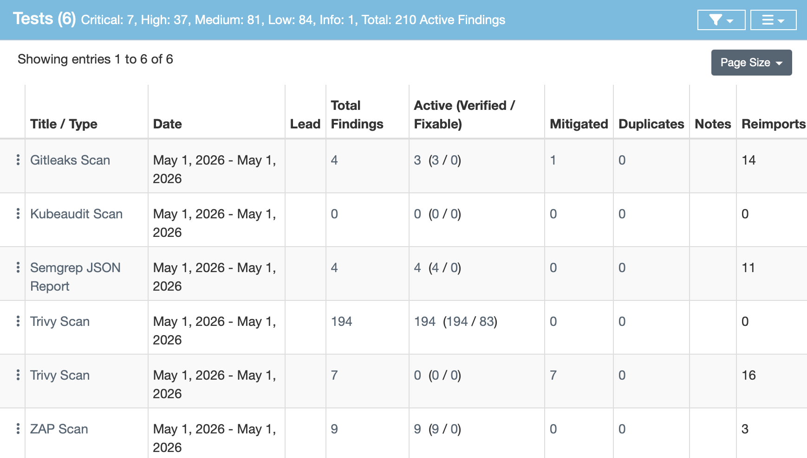

## 🛡️ Secure CI/CD Pipeline with ASPM Integration

### 📝 Обзор проекта
Этот проект представляет собой реализацию защищенного конвейера доставки приложения (**DevSecOps Pipeline**), интегрированного с системой управления уязвимостями **DefectDojo**. Основная цель — внедрение проверок безопасности на каждом этапе жизненного цикла разработки (SDLC).

---

### 🚀 Архитектура безопасности
Пайплайн реализует стратегию **Defense in Depth** (эшелонированная оборона) и включает в себя следующие уровни защиты:

| Этап | Инструмент | Описание |
| :--- | :--- | :--- |
| **SCA** | **Trivy (FS)** | Анализ зависимостей Python (requirements.txt) на наличие известных CVE. |
| **Secrets** | **Gitleaks** | Сканирование истории коммитов на наличие забытых API-ключей и токенов. |
| **SAST** | **Semgrep** | Статический анализ исходного кода на наличие опасных паттернов (Injection, и т.д.). |
| **IaC Scan** | **Kubesec** | Проверка манифестов Kubernetes на ошибки конфигурации безопасности. |
| **Container** | **Trivy (Image)** | Сканирование Docker-образа на уязвимости системных библиотек (OS scan). |
| **DAST** | **OWASP ZAP** | Динамическое тестирование запущенного приложения методом «черного ящика». |
| **ASPM** | **DefectDojo** | Централизованный сбор, дедупликация и менеджмент всех находок. |

---

### 📊 Управление уязвимостями (DefectDojo)
Все результаты сканирования автоматически импортируются в **DefectDojo**. Это позволяет:
*   Видеть полную картину рисков в одном окне.
*   Отслеживать динамику исправлений.
*   Дедуплицировать находки (если SAST и DAST нашли одну и ту же проблему).

> **Инсайт:** Интеграция настроена через GitHub Actions с использованием API DefectDojo, что обеспечивает актуальность данных при каждом пуше в ветку `main`.

  

---

### 🛠️ Как запустить сканирование
1. Сделайте Fork репозитория.
2. Настройте GitHub Secrets:
    *   `DEFECTDOJO_URL`: URL вашего экземпляра (например, через ngrok).
    *   `DEFECTDOJO_TOKEN`: API-ключ администратора.
3. Внесите изменения в код и сделайте `git push`.
4. Наблюдайте за процессом во вкладке **Actions**.

---

### 💡 Что было исправлено/обнаружено
*   **Command Injection:** Обнаружено с помощью Semgrep и подтверждено OWASP ZAP.
*   **Hardcoded Credentials:** Gitleaks предотвратил утечку AWS и Google API ключей.
*   **Vulnerable Base Image:** Trivy выявил 100+ уязвимостей в образе `python:3.9-slim`, что привело к рекомендации перейти на `alpine` или `distroless`.

---

### 🏁 Заключение
Данный проект демонстрирует концепцию **Shift Left Security** — обнаружение и исправление уязвимостей на ранних этапах разработки, что значительно снижает стоимость исправления ошибок и повышает общую защищенность продукта.
